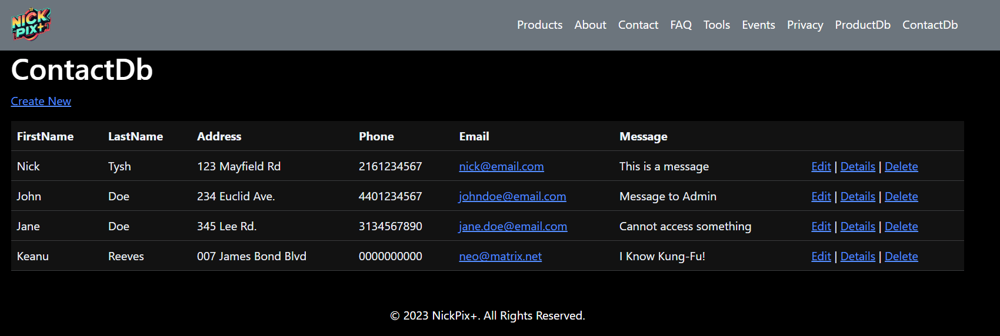
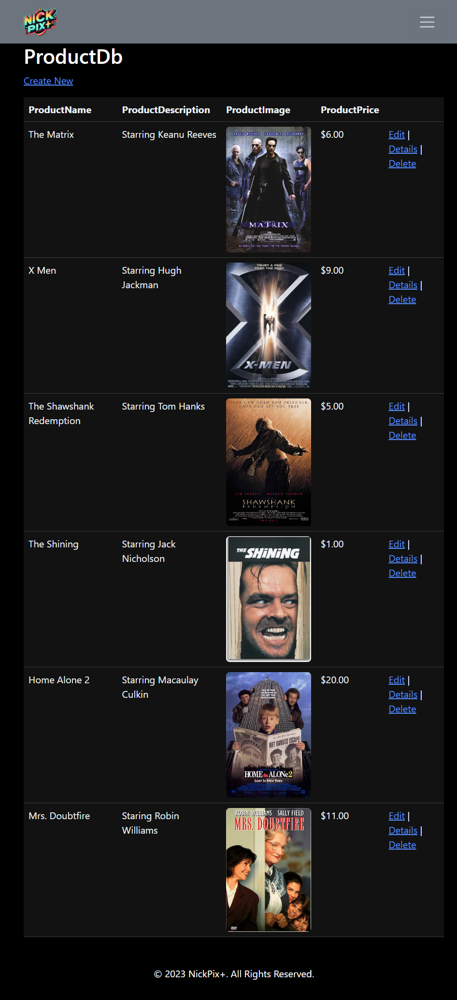

# Week 14 Lab Summary
- Add NuGet packages for Entity Framework Core to enable database access
- Add DbContext class for accessing database
- Configure connection strings to database
- Enable dependency injection in Program.cs
- Use scaffolding to auto-generate CRUD pages for Products and Contacts
- Run EF Core migrations to create SQL database
- Seed Contacts table with 4 entries  
- Update Product views to display images from database

## Outcomes
- Application utilizes SQL database to store products and contacts
- Learned how to perform CRUD operations on data
- Migrations handles database creation and schema changes
- Scaffolding that generates CRUD pages  

# ContactDb contacts screenshot

# ProductDb products screenshot
